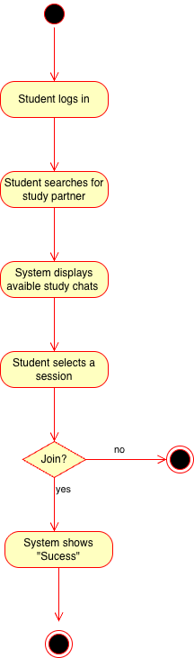
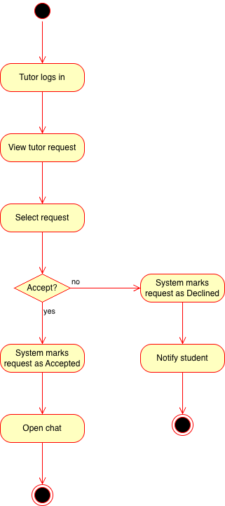

# Specification Phase Exercise

A little exercise to get started with the specification phase of the software development lifecycle. See the [instructions](instructions.md) for more detail.

## Team members

- [Gavin Chen](https://github.com/OverYander)
- [Meili Liang](https://github.com/ml8397)
- [George Sanabria](https://github.com/sanabriageorge)
- [Hanlin Yan](https://github.com/hanlinyan-dev)

## Stakeholders

### Stakeholder 1: Student

**Name:** Jenna  
**Description:** A junior NYU student majoring in Mathematics and Data Science. Jenna frequently studies with peers and occasionally seeks academic help outside of class. She is interested in a product that helps her efficiently find appropriate study partners while avoiding unreliable or malicious interactions.

### Goals and Needs

- **Filtered Study Partner Matching:**  
  Jenna wants the platform to filter out irrelevant or harmful responses, such as homework ghostwriting services or spam accounts, so that her study requests reach genuine students with similar academic goals.

- **Efficient Discovery of Study Partners:**  
  Jenna often feels unsure about where to post study partner requests and wants a single place that clearly matches her with appropriate peers.

### Problems and Frustrations

- **Unclear Distinction Between Free and Paid Tutoring:**  
  Jenna is aware that most colleges offer free academic resources, including tutoring services, and finds it unclear why tutoring on the platform requires payment or how it differs in value.

- **Concerns About Tutor Quality and Credibility:**  
  Unlike official university tutoring services, Jenna finds it difficult to assess the qualifications and teaching quality of tutors on informal platforms, making her reluctant to rely on them.

- **Reluctance to Pay for Academic Help:**  
  As a college student without a stable income, Jenna is cautious about paying for tutoring services. She expects the product to clearly offer value beyond traditional tutoring, such as flexibility, peer learning, or shared academic culture.

### Stakeholder 2: Tutor

**Name:** Ouyang  
**Description:** A senior Baruch College student majoring in Computer Information Systems. Ouyang performs well academically and does not usually seek study partners herself. However, she is interested in serving as a tutor through the platform.

### Goals and Needs

- **Gaining Experience:**
  Ouyang values the opportunity to reinforce her own knowledge by helping others. She also sees tutoring as a meaningful experience that could strengthen her resume if the platform gains credibility.

- **Earning Income:**  
  Ouyang expects fair financial compensation for her tutoring services and values transparency in how opportunities are distributed.

### Problems and Frustrations

- **Unbalanced Supply and Demand:**  
  Ouyang is concerned that the platform may attract more tutors than students, resulting in fewer opportunities for tutors to receive requests and making it difficult to justify continued participation.

- **Unclear Commitment From Students:**  
  Ouyang worries that students may respond slowly, cancel sessions at the last minute, or lack clear expectations, making it difficult for tutors to manage their time efficiently.

## Product Vision Statement

An app that provides students with the option to find study buddies or submit tutor requests in which tutors can choose to accept or deny them.

## User Requirements

- As a student, I want to find someone else I can study with so I can get help with a class.
- As a student, I want to easily submit a tutor request so that I can get help quickly when needed.
- As a student, I want help from a tutor so that I can receive help from someone who is knowledgeable on the subject.
- As a student, I want to message both other students and tutors so that I can easily communicate and set up times with them.
- As a student, I want to view tutor ratings so that I can get the best help on a subject.
- As a student, I want to find peers who are studying the same material.
- As a student, I want to see basic information about a study partner or tutor so that I can decide whether they are a good fit before contacting them.
- As a student, I want to schedule a study or tutoring session so that both parties have a clear and agreed-upon meeting time.
- As a student, I want to specify my study topics so that I can be matched with compatible study partners.
- As a student, I want to view upcoming study or tutoring sessions so that I can manage my schedule effectively.

- As a tutor, I want to edit a tutor profile so that students can see what subjects I can help with.
- As a tutor, I want to see details of a tutor request so that I know the topic, time, and expectations.
- As a tutor, I want to chat with a student after accepting a request so that we can coordinate tutoring details.
- As a tutor, I want to accept or decline a tutor request so that I am not forced to take requests I cannot handle.
- As a tutor, I want to view tutor requests so that I can decide which students to help.
- As a tutor, I want to receieve notifications when a new request apears so that I do not miss opportunities.
- As a tutor, I want to receieve payments through the app so that I do not have to worry about handling money.
- As a tutor, I want students to leave reviews so that I can build my credibility.
- As a tutor, I want to view my tutoring history so that I can view past sessions. 
- As a tutor, I want to decide my schedule by choosing certain requests so that I do not overload myself. 

## Activity Diagrams

### As a student, I want to find someone else I can study with so I can get help with a class.

### As a student, I want to easily submit a tutor request so that I can get help quickly when needed.

### As a tutor, I want to edit a tutor profile so that students can see what subjects I can help with.

### As a tutor, I want to accept or decline a tutor request so that I am not forced to take requests I cannot handle.

## Clickable Prototype
[Prototype](https://www.figma.com/proto/Tt6emtfzOsoDzLULKZm09J/Badgers---CramTgther?t=DJKuvpdRpcNCaClO-1)
